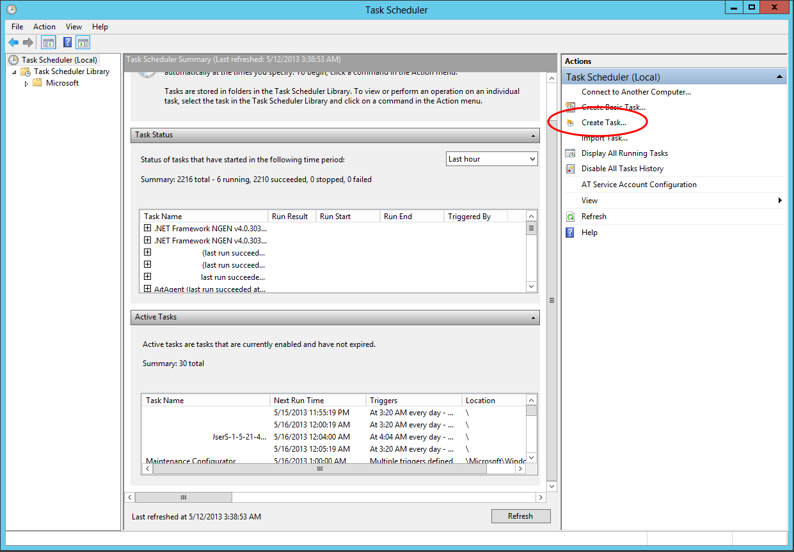
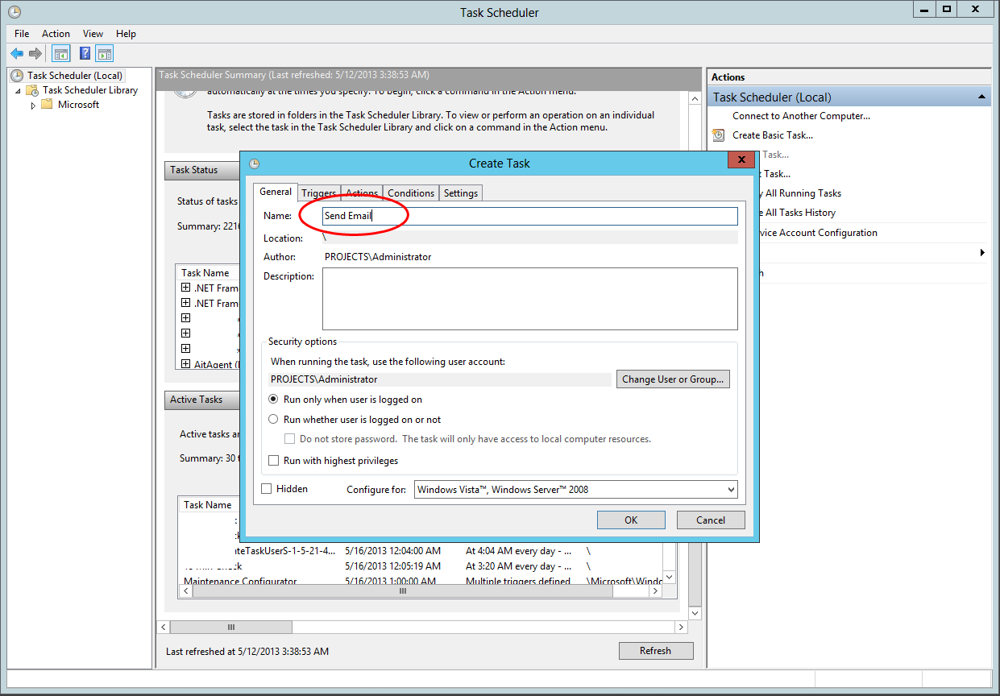
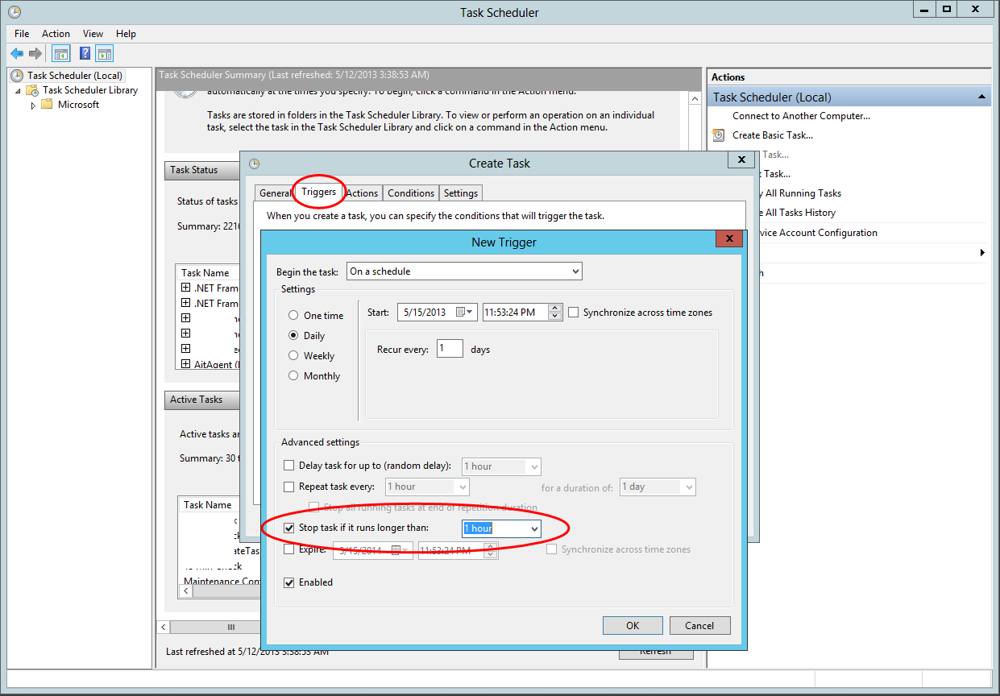
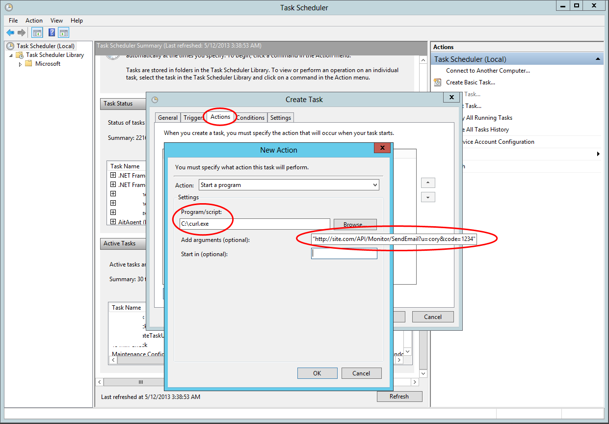
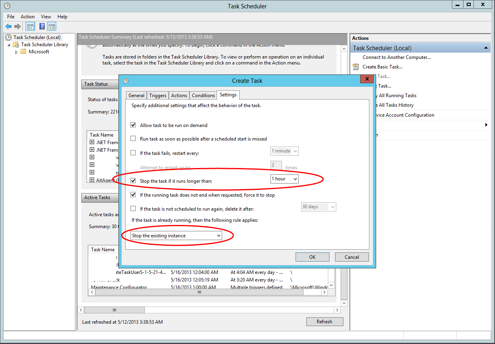
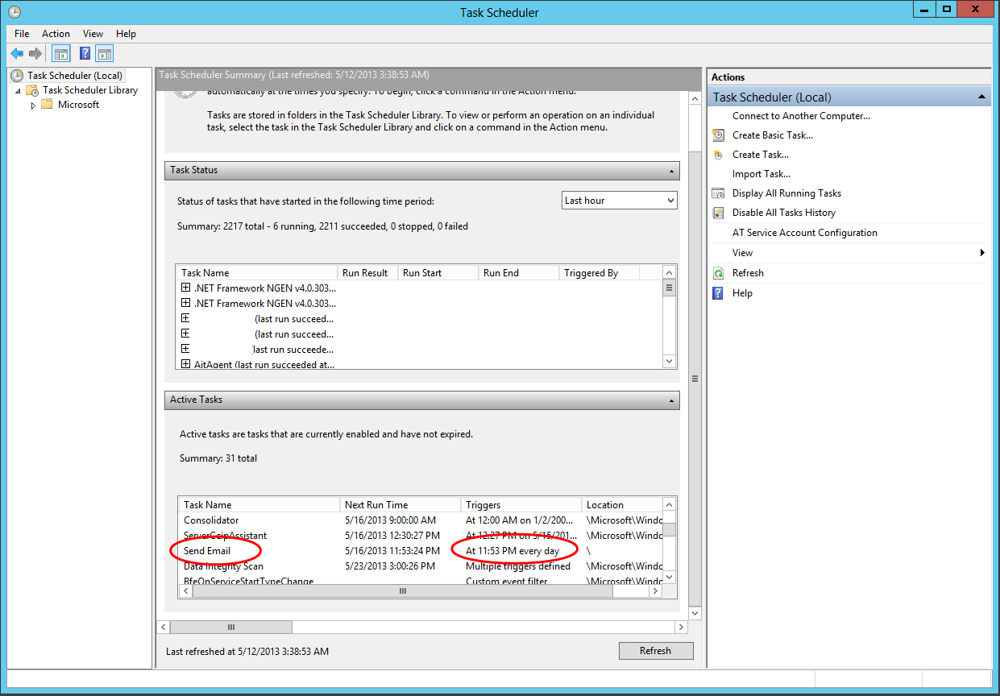

After much searching across the internet I have found no easy way to set up something similar to Cron Jobs in ASP.NET MVC. Such a simple thing that I would have thought someone solved already that is simple and easy-to-use. Now you may be thinking, “Hey, what about Quartz.Net”. And you are right, [Quartz.Net](http://www.quartz-scheduler.net/) does offer this functionality for the .NET framework. There are a couple problems that I found with Quartz.Net while working with it.

<span class="more"></span>

First, Quartz.Net Server requires that the DLL containing your classes be housed with the Quartz.Net Server executable or otherwise locatable by it. This is a huge pain for me. I housed my Quartz.Net Server on a production server while I wanted to test my apps on my dev server. This required that I copy the DLL’s from a build to the production server every time I wanted to test the jobs. This is a tedious process.

Secondly, Quartz.Net is somewhat complex to set up. It does get easier after the first time you do it, but it requires a lot of set up time to get everything working perfectly. Some people may be willing to take the time because honestly Quartz.Net is **very** powerful. It has a ton of features that I can see provide so much use for so many situations, but for most project you do not need these features. In the projects that I have needed Cron Jobs for it is usually a simple job such as sending a daily email report. For this situation using Quartz.Net is like using a wreaking ball to remove a nail in your wall.

Thirdly, Quartz.Net’s documentation is lacking. They do have a tutorial on their website, but it is a little outdated (as of this writing). There are a couple of guides that exist out there, but they are all incomplete. There is also the smattering of knowledge locked up in hundreds of threads over at Stack Overflow. To me this sucks. So on to how I solved the problem for myself.

Now this is kind of a hacked together solution, but the only solution that I found works without fail, is very easy to set up, and can be used to automate any task that I have needed or can think of right now. A brief overview of the solution is below for those who just want the overall idea and what to implement it on your own.

*  Set up public API controller in your app to run the tasks that you want to automate. Ex. http://yourapp.com/API/Admin/SendEmail
*  Set it up using HttpGet so that every time the URL is hit the task will run. No need for returns here, this is only to trigger the event.
*  Download cURL for windows ([bottom of the page](http://curl.haxx.se/download.html))
*  Set up a task in windows task scheduler to run curl.exe with the API URL as its parameter at the frequency that you want.
Done!

Below is the full walk-through on how I did it for my [app](uptime.corywestropp.com). A few things before we move on. the Windows Task Scheduler only allows tasks to run every 5 minutes minimum, which means this approach will not work if you need a task to run more often then that. Also, this exposes your API to the public so anyone that figures out the URL can call your controller whenever they want as many times as they want. Make sure you consider security and apply some restrictions as you deem appropriate. In my app I used a 10 digit “code” as a URL parameter and checked to see if the code is correct before running anything. Simple, but effective for a personal project.

*NOTE:* If you use URL parameters in your API URL make sure you put the full URL in parentheses when adding the task to the Windows Task Scheduler. cURL will not recognize the URL with parameters of it is not in quotes.

Firstly, Set up a public API controller in your app
---------------------------------------------------

The first step is to set up an API controller in your app that will do all the work that you want to do for these particular task. An example would be sending a weekly update email to admins, or running maintenance tasks.

```
public class MonitorController : ApiController
    {
    [HttpGet]
    public int SendEmail(string user, string code)
    {
        if (code == "1234")
        {
            //Run your job here
            return 1;
        }
        else
        {
            return 0;
        }
    }
}
```

This controller is accessible from **http://yoursite.com/API/Monitor/SendEmail**

Download cURL and put it somewhere you will remember
----------------------------------------------------

Go and download cURL from [here](http://curl.haxx.se/download.html) the link is at the bottom of the page. But the EXE in a place you will remember, but also in a place that will be safe from deletion. If the EXE gets deleted then obviously all your tasks will stop working.

Set up the Windows Task Scheduler
---------------------------------

Go to the Windows task Scheduler and create a new task, not a basic task.



Next, name your task something descriptive and move on to Triggers



Then set your trigger. I set mine to stop if it runs to long just in case.



Set your action. Browse to the folder that you saved cURL.exe in and set that as the program to start. Then set the “Add Arguments” box to the API URL that you created earlier.



Set the settings how you see fit.



Finally, your done! Check out your new automated task in the Task Scheduler.



<hr>

cUrl: [http://curl.haxx.se/download.html](http://curl.haxx.se/download.html)